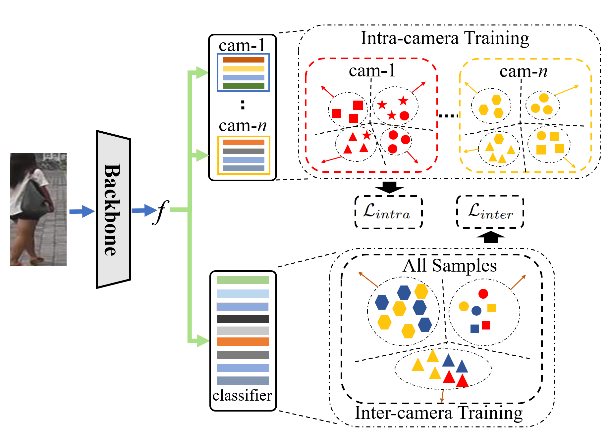
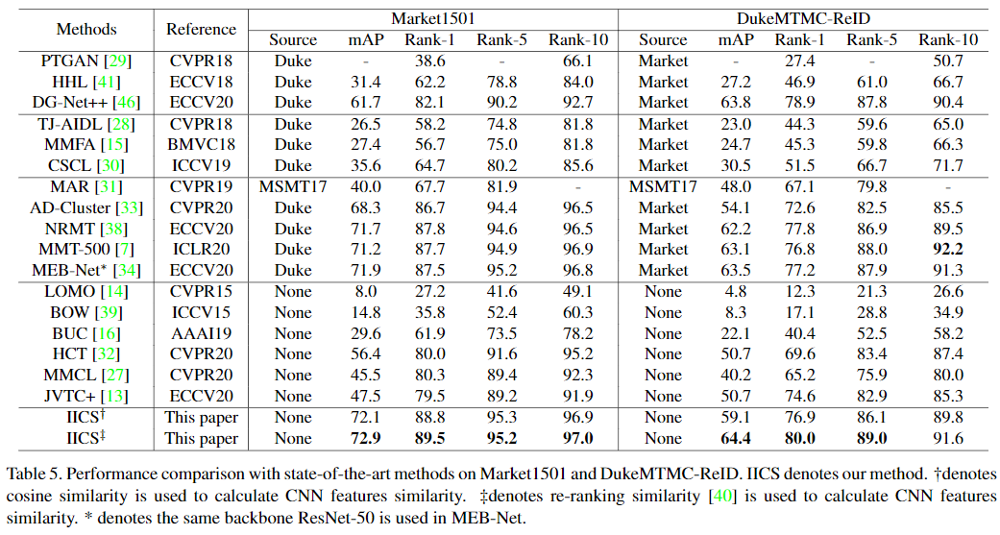
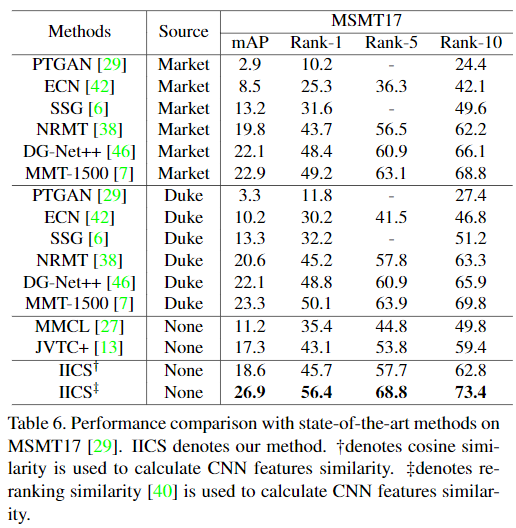

# IICS
Pytorch implementation of Paper "Intra-Inter Camera Similarity for Unsupervised Person Re-Identification" (CVPR 2021)



## Installation
### 1. Clone code
```
    git clone git@github.com:SY-Xuan/IICS.git
    cd ./IICS
```

### 2. Install dependency python packages
```
    conda create --name IICS --file requirements.txt
``` 

### 3. Prepare dataset
Download Market1501, DukeMTMC-ReID, MSMT17 from website and put the zip file under the directory like
```
MMT/examples/data
├── dukemtmc
│   └── raw
|       └──DukeMTMC-reID.zip
├── market1501
|   └── raw
│       └── Market-1501-v15.09.15.zip
|── msmt17
|   └── raw
|       └── MSMT17_V2.zip
```
## Usage
### 1. Download trained model
* [Market1501](https://pkueducn-my.sharepoint.com/:f:/g/personal/shiyu_xuan_stu_pku_edu_cn/Er0V5oh4nadBliFIrzGRsl8BGJ-ibjAUt64t4oN10n_rhQ?e=YIJVvU)
* [DukeMTMC-ReID](https://pkueducn-my.sharepoint.com/:f:/g/personal/shiyu_xuan_stu_pku_edu_cn/Er0V5oh4nadBliFIrzGRsl8BGJ-ibjAUt64t4oN10n_rhQ?e=YIJVvU)
* [MSMT17](https://pkueducn-my.sharepoint.com/:f:/g/personal/shiyu_xuan_stu_pku_edu_cn/Er0V5oh4nadBliFIrzGRsl8BGJ-ibjAUt64t4oN10n_rhQ?e=YIJVvU)

### 2. Evaluate Model
Change the checkpoint path in the ./script/test_market.sh
```
sh ./script/test_market.sh
```

### 3. Train Model
You need to download ResNet-50 imagenet pretrained model and change the checkpoint path in the ./script/train_market.sh
```
sh ./script/train_market.sh
```

We also provide a better version of our method which can adaptively determine clustering number by setting a similarity threshold
```
sh ./script/train_market_threshold.sh
```

## Results
|Datasets | mAP | Rank@1| Method |
| :--------: | :-----: | :----: | :----: |
|Market1501 | 72.9% | 89.5% | original |
|Market1501 | 73.9% | 90.1% | threshold |
|DukeMTMC-ReID | 64.4% | 80.0% | original |
|DukeMTMC-ReID | 66.2% | 80.8% | threshold |
|MSMT17 | 26.9% | 56.4% | original |
|MSMT17 | 31.9% | 62.6% | threshold |





## Citations
If you find this code useful for your research, please cite our paper:

@article{xuan2021intrainter,
      title={Intra-Inter Camera Similarity for Unsupervised Person Re-Identification}, 
      author={Shiyu Xuan and Shiliang Zhang},
      year={2021},
      journal={arXiv preprint arXiv:2103.11658},
}
## Contact me
If you have any questions about this code or paper, feel free to contact me at
shiyu_xuan@stu.pku.edu.cn.

## Acknowledgement
Codes are built upon [open-reid](https://github.com/Cysu/open-reid).
